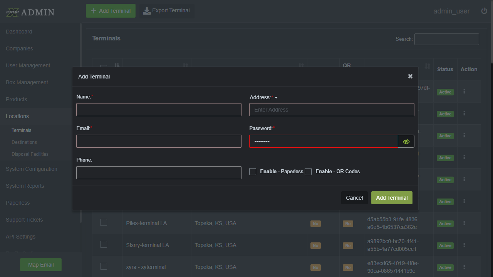

# PX Regression Automation

A simple Playwright test project for PX regression flows.
This repository contains end-to-end automation for login, job creation, and terminal setup.

## What this project does

- Logs in to the PX application
- Creates job settings and roles
- Sets up demurrage, product, carrier, permissions, terminal, notes, and pictures
- Includes reusable page objects and test fixtures

## Prerequisites

- Node.js 18+ installed
- Git installed

## Install dependencies

```bash
npm install
```

## Run the tests

Run all Playwright tests:

```bash
npm test
```

Run a specific test file:

```bash
npx playwright test tests/createJob.spec.ts
```

## Project structure

- `tests/` - Playwright test files
- `pages/` - Page object classes
- `fixtures/` - Test data for login, job, and terminal flows
- `screenshots/` - Example screenshots from the application
- `playwright-report/` - Generated Playwright HTML reports

## Example screenshot

This screenshot shows the terminal creation or setup UI step used in the automation.



> The image is stored at `addterminal.png` in the repository root.

## Notes

- The repo uses `@playwright/test` for testing.
- Use `npm run test:ui` if you want the Playwright UI test runner.
- Reports are generated in the `playwright-report/` folder after a test run.
